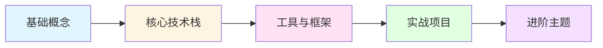

# AI Agent 从零到实战学习大纲 🤖

> **学习时长**：3-4 个月（全职学习）或 6-8 个月（业余时间）  
> **难度等级**：⭐⭐⭐⭐ (需要有编程基础和机器学习基础)  
> **核心语言**：Python (必须)  
> **终极目标**：能独立设计并实现一个解决实际问题的 AI Agent 系统

---

## 📚 学习路线图总览



---

## 第一阶段：AI Agent 基础概念 🎯

### 1.1 什么是 AI Agent？

> **比喻**：如果 ChatGPT 是个聊天机器人，那 AI Agent 就是个有手有脚的行动派机器人 🦾

**核心概念**：

- **Agent（代理）**：能感知环境、自主决策、执行动作的智能实体
- **与传统 AI 的区别**：
  - 传统 AI：输入 → 输出（一次性）
  - AI Agent：观察 → 思考 → 行动 → 再观察（循环）

**必学知识点**：

- [ ] Agent 的四大要素：Perception（感知）、Reasoning（推理）、Action（行动）、Memory（记忆）
- [ ] Agent 的分类：
  - Simple Reflex Agent（简单反射型）
  - Model-Based Agent（基于模型）
  - Goal-Based Agent（基于目标）
  - Utility-Based Agent（基于效用）
  - Learning Agent（学习型，最强！）

**实战练习**：

```python
# 用伪代码描述一个简单的温控 Agent
class ThermostatAgent:
    def perceive(self):
        # 感知当前温度
        return current_temperature

    def decide(self, temp):
        # 推理：太冷就开暖气，太热就开空调
        if temp < 18:
            return "turn_on_heater"
        elif temp > 26:
            return "turn_on_ac"
        return "do_nothing"

    def act(self, action):
        # 执行动作
        execute(action)
```

**学习资源**：

- 📖 书籍：《Artificial Intelligence: A Modern Approach》（第 2 章）
- 🎥 视频：Andrew Ng 的 AI Agent 入门课

---

### 1.2 大语言模型（LLM）基础

> **重要**：现代 AI Agent 的大脑就是 LLM！不懂 LLM 就别想玩转 Agent 🧠

**必学知识点**：

- [ ] LLM 的工作原理（Transformer、注意力机制）
- [ ] Prompt Engineering（提示词工程）
  - Zero-shot、Few-shot、Chain-of-Thought (CoT)
  - ReAct（Reasoning + Acting）模式
- [ ] LLM 的局限性：
  - 幻觉（Hallucination）
  - 上下文窗口限制
  - 无法直接访问外部世界

**实战练习**：

- 用 OpenAI API 或本地模型（Ollama）实现不同的 Prompt 策略
- 对比 Zero-shot vs Few-shot 的效果差异

**代码示例**：

```python
# Chain-of-Thought 示例
prompt = """
问题：小明有 5 个苹果，吃了 2 个，又买了 3 个，现在有几个？

让我们一步步思考：
1. 初始：5 个
2. 吃了 2 个：5 - 2 = 3
3. 买了 3 个：3 + 3 = 6
答案：6 个
"""
```

**学习资源**：

- 🔗 [Prompt Engineering Guide](https://www.promptingguide.ai/)
- 📄 论文：《ReAct: Synergizing Reasoning and Acting in Language Models》

---

### 1.3 Agent 的核心组件

**记忆（Memory）**：

- **短期记忆**：当前对话的上下文
- **长期记忆**：向量数据库（如 Pinecone、Weaviate）

**工具使用（Tool Use）**：

- 函数调用（Function Calling）
- API 集成（搜索引擎、数据库、外部服务）

**规划（Planning）**：

- 任务分解（Task Decomposition）
- 多步推理（Multi-Step Reasoning）

---

## 第二阶段：核心技术栈 ⚙️

### 2.1 向量数据库与 RAG

> **RAG = Retrieval-Augmented Generation**：让 LLM 能"查资料"，不再瞎编 📚

**必学知识点**：

- [ ] Embedding（文本向量化）
  - 使用 OpenAI Embeddings 或开源模型（sentence-transformers）
- [ ] 向量数据库的选择：
  - Chroma（本地开发首选）
  - Pinecone（云端托管）
  - Weaviate（生产级）
- [ ] RAG 的工作流程：
  1. 文档切块（Chunking）
  2. 向量化存储
  3. 语义检索（Semantic Search）
  4. 增强生成

**实战项目**：

```python
# 使用 LangChain 实现简单的 RAG
from langchain.vectorstores import Chroma
from langchain.embeddings import OpenAIEmbeddings
from langchain.text_splitter import RecursiveCharacterTextSplitter
from langchain.chains import RetrievalQA
from langchain.llms import OpenAI

# 1. 文档加载与切块
docs = load_documents("./knowledge_base")
text_splitter = RecursiveCharacterTextSplitter(chunk_size=1000)
chunks = text_splitter.split_documents(docs)

# 2. 向量化存储
vectorstore = Chroma.from_documents(chunks, OpenAIEmbeddings())

# 3. 构建检索链
qa_chain = RetrievalQA.from_chain_type(
    llm=OpenAI(),
    retriever=vectorstore.as_retriever()
)

# 4. 提问
answer = qa_chain.run("AI Agent 的核心组件是什么？")
```

**学习资源**：

- 🎥 [RAG 完整教程（中文）](https://www.bilibili.com/video/BV1XXXXXX)
- 📖 LangChain 官方文档

---

### 2.2 函数调用（Function Calling）

> **这是 Agent 的"手"！** 让 LLM 不仅会说话，还能干活 🛠️

**必学知识点**：

- [ ] OpenAI Function Calling 的原理
- [ ] 工具定义（Tool Schema）
- [ ] 参数解析与执行
- [ ] 多轮对话中的函数调用

**实战示例**：

```python
# 定义工具
tools = [
    {
        "type": "function",
        "function": {
            "name": "get_weather",
            "description": "获取指定城市的天气",
            "parameters": {
                "type": "object",
                "properties": {
                    "city": {"type": "string", "description": "城市名称"}
                },
                "required": ["city"]
            }
        }
    }
]

# 调用
response = openai.chat.completions.create(
    model="gpt-4",
    messages=[{"role": "user", "content": "北京今天天气怎么样？"}],
    tools=tools
)

# 执行函数
if response.choices[0].message.tool_calls:
    function_name = response.choices[0].message.tool_calls[0].function.name
    arguments = json.loads(response.choices[0].message.tool_calls[0].function.arguments)
    result = get_weather(**arguments)
```

---

### 2.3 多智能体系统（Multi-Agent）

> **一个诸葛亮，顶不过三个臭皮匠（有时候）** 🧑‍🤝‍🧑

**核心概念**：

- **协作模式**：
  - Debate（辩论型）：多个 Agent 讨论得出最佳方案
  - Hierachical（层级型）：主 Agent 分配任务给子 Agent
  - Swarm（集群型）：多个 Agent 并行处理

**框架选择**：

- AutoGen（微软出品，强大！）
- MetaGPT（角色扮演式多智能体）
- LangGraph（LangChain 的多智能体版）

**实战示例**（AutoGen）：

```python
from autogen import AssistantAgent, UserProxyAgent

# 创建两个 Agent
assistant = AssistantAgent("助手", llm_config={"model": "gpt-4"})
user_proxy = UserProxyAgent("用户", code_execution_config={"work_dir": "coding"})

# 让它们协作
user_proxy.initiate_chat(
    assistant,
    message="帮我写一个 Python 脚本，爬取天气数据并可视化"
)
```

---

## 第三阶段：工具与框架 🧰

### 3.1 LangChain 深度学习

> **LangChain = AI Agent 的瑞士军刀** 🔪

**核心模块**：

- [ ] **Chains（链）**：组合多个步骤
  - LLMChain、SequentialChain、RouterChain
- [ ] **Agents（代理）**：自主决策执行工具
  - Zero-shot ReAct Agent
  - Conversational Agent
- [ ] **Memory（记忆）**：
  - ConversationBufferMemory
  - ConversationSummaryMemory
  - VectorStoreMemory

**实战：构建一个客服 Agent**：

```python
from langchain.agents import initialize_agent, Tool
from langchain.llms import OpenAI
from langchain.memory import ConversationBufferMemory

# 定义工具
tools = [
    Tool(
        name="订单查询",
        func=query_order,
        description="根据订单号查询订单状态"
    ),
    Tool(
        name="退款申请",
        func=refund_request,
        description="提交退款申请"
    )
]

# 初始化 Agent
agent = initialize_agent(
    tools,
    OpenAI(temperature=0),
    agent="conversational-react-description",
    memory=ConversationBufferMemory(memory_key="chat_history")
)

# 对话
agent.run("我的订单 123456 什么时候能到？")
```

---

### 3.2 LangGraph：复杂流程编排

> **当 LangChain 不够灵活时，LangGraph 登场！** 它能处理循环、条件分支等复杂逻辑 🔄

**核心概念**：

- 将 Agent 工作流定义为状态图（State Graph）
- 支持循环、条件跳转、并行执行

**示例：带人工审核的 Agent**：

```python
from langgraph.graph import StateGraph

# 定义状态
workflow = StateGraph()
workflow.add_node("生成草稿", draft_generator)
workflow.add_node("人工审核", human_review)
workflow.add_node("修改", revise)

# 定义流程
workflow.add_edge("生成草稿", "人工审核")
workflow.add_conditional_edges(
    "人工审核",
    lambda x: "修改" if x["needs_revision"] else "结束"
)

app = workflow.compile()
```

---

### 3.3 本地模型部署（Ollama）

> **不想花钱调 API？本地模型了解一下！** 💰

**推荐模型**：

- **Llama 3.2**（Meta，性能强）
- **Qwen 2.5**（阿里，中文友好）
- **DeepSeek**（性价比之王）

**安装与使用**：

```bash
# 安装 Ollama
curl -fsSL https://ollama.com/install.sh | sh

# 下载模型
ollama pull llama3.2

# 在 LangChain 中使用
from langchain.llms import Ollama
llm = Ollama(model="llama3.2")
```

---

## 第四阶段：实战项目 💼

### 项目 1：智能 TODO 助手

**功能**：

- 自然语言添加任务（"提醒我明天下午 3 点开会"）
- 自动分类任务（工作、生活、学习）
- 智能提醒与优先级排序

**技术栈**：

- LangChain + OpenAI
- SQLite（存储任务）
- APScheduler（定时提醒）

---

### 项目 2：文档问答机器人（RAG）

**功能**：

- 上传 PDF/Word 文档
- 基于文档内容回答问题
- 引用来源（显示答案出自哪一页）

**技术栈**：

- LangChain + Chroma
- Streamlit（Web 界面）
- PyPDF2（文档解析）

---

### 项目 3：自动化数据分析 Agent

**功能**：

- 用户提问："分析这份销售数据，找出趋势"
- Agent 自动：
  1. 读取 CSV
  2. 生成 Pandas 代码
  3. 执行代码
  4. 生成可视化图表
  5. 总结结论

**技术栈**：

- LangChain Agents + Code Interpreter
- Pandas、Matplotlib

---

### 项目 4：多智能体研究助手

**功能**：

- 用户提供研究主题
- Agent 1：从网上搜索相关论文
- Agent 2：总结论文核心观点
- Agent 3：生成研究报告

**技术栈**：

- AutoGen 或 MetaGPT
- Serper API（搜索）
- Arxiv API（论文）

---

## 第五阶段：进阶主题 🚀

### 5.1 Agent 性能优化

- **减少 Token 消耗**：
  - 使用更小的模型（GPT-3.5 vs GPT-4）
  - 压缩上下文（Memory Summarization）
- **提升响应速度**：
  - 流式输出（Streaming）
  - 并行工具调用
- **成本控制**：
  - 缓存重复查询
  - 混合使用本地模型 + 云端模型

---

### 5.2 Agent 安全与可靠性

- **Prompt Injection 防御**：防止用户通过提示词攻击 Agent
- **工具调用权限控制**：限制 Agent 能执行的操作范围
- **幻觉检测**：验证 Agent 输出的准确性

---

### 5.3 前沿技术跟踪

- [ ] **OpenAI Assistants API**：官方提供的 Agent 解决方案
- [ ] **思维树（Tree of Thoughts）**：更强的推理能力
- [ ] **反思（Reflexion）**：Agent 自我纠错机制
- [ ] **工具学习（Tool Learning）**：Agent 自主发现并使用新工具

**论文推荐**：

- 📄 《ReAct: Synergizing Reasoning and Acting in Language Models》
- 📄 《Reflexion: Language Agents with Verbal Reinforcement Learning》
- 📄 《Toolformer: Language Models Can Teach Themselves to Use Tools》

---

## 🎯 学习建议

1. **边学边做**：每学完一个概念，立刻写代码验证
2. **从简单到复杂**：先用 OpenAI API，再尝试本地模型
3. **关注最佳实践**：
   - 结构化日志（方便调试）
   - 单元测试（验证工具可靠性）
   - 版本控制（Git 管理 Prompt）
4. **加入社区**：
   - LangChain Discord
   - Reddit r/LangChain
   - GitHub Discussions

---

## 📚 资源汇总

### 必读书籍

- 《Building LLM Applications》
- 《Generative AI with LangChain》

### 必刷课程

- DeepLearning.AI 的 LangChain 系列课程（免费！）
- Coursera 的《AI Agents》

### 必逛网站

- [LangChain 官方文档](https://python.langchain.com/)
- [OpenAI Cookbook](https://cookbook.openai.com/)
- [Prompt Engineering Guide](https://www.promptingguide.ai/)

---

## 🏁 结语

学习 AI Agent 就像学习骑自行车 🚴：一开始摇摇晃晃，但一旦掌握了平衡点（理解 LLM + 工具调用 + 记忆），你就能自由驰骋了！

**记住**：Agent 的核心不是炫技，而是解决实际问题。从小项目开始，逐步积累经验，你也能成为 AI Agent 领域的老司机！💪

---

**Happy Coding! 🎉**
